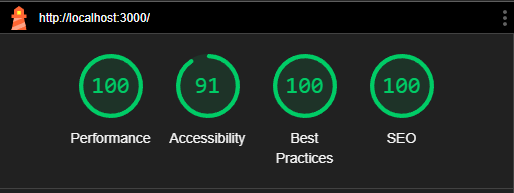

<div align="center">

&nbsp;

![Node_Badge][node_version_badge] ![vue_badge][vue_badge] ![javascript][javascript] ![sass][sass] ![vite][vite]

</div>

## **:rocket: Objetivo**

Este projeto foi desenvolvido como **desafio técnico** da empresa **Mercado Bitcoin**. Consiste em uma aplicação web responsiva para cadastro de usuários.

## **:computer: Tecnologias**

- **Vue 3 - Framework Front-end**
- **Javascript - Linguagem**
- **Scss - Estilos**
- **Express - Server**
- **date-fns - Formatação de data**
- **Vuelidate - Validação de formulário**
- **Vue-the-mask - Máscara para inputs**

## **⚡Executando o projeto em ambiente local**

```sh
git clone https://github.com/rafaelst2000/mercadobitcoin.git
cd mercadobitcoin
npm install
npm run start
acesse http://localhost:3000/registration pelo seu navegador.
```

## **📩 Commits**

- Seguindo o padrão do _Conventional Commits_

## **📝 Anotações**

O Accessibility do lighthouse não bateu nota 100 por causa do contraste no botão de ação, onde o fundo era laranja e a cor do texto branca.
Optei por seguir o design nesse caso ao invés de buscar uma cor para bater nota 100.

<br />
<div align="center">
  Made by <a href="https://www.linkedin.com/in/rafaelst2000/" target="_blank">Rafael Trevisan</a>
</div>

<!-- Badges -->

[node_version_badge]: https://img.shields.io/badge/Node-20.14.0-green
[vue_badge]: https://img.shields.io/badge/Web-Vue3-green
[javascript]: https://img.shields.io/badge/JS-Javascript-yellow
[sass]: https://img.shields.io/badge/CSS-SCSS-pink
[vite]: https://img.shields.io/badge/Vite-5.2.8-purple
